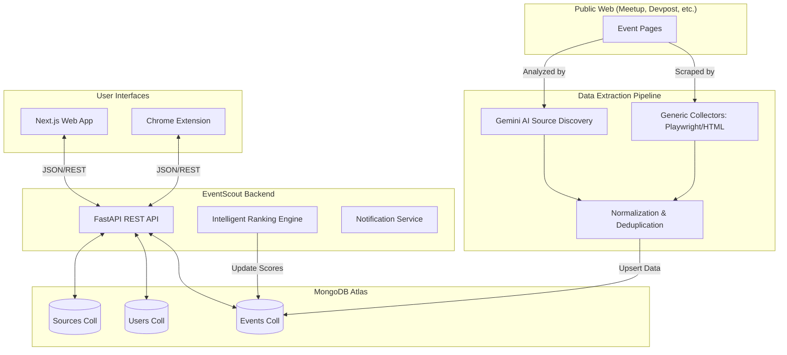
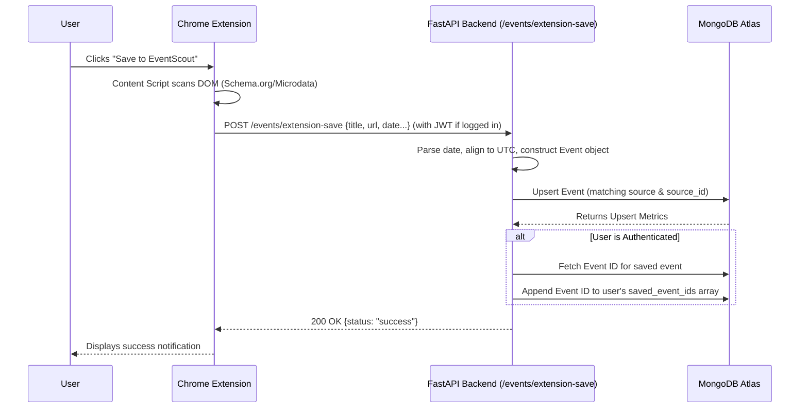

# System Architecture & End-to-End Workflow Guide

## 1. High-Level System Architecture

EventScout is a multi-tier, autonomous technical opportunity discovery platform. It aggregates hackathons, workshops, and developer conferences across various platforms, normalizes them, and ranks them using an intelligent scoring engine.

### Component Overview

- **Frontend (Web App)**: Next.js 15 (App Router) based responsive web application for users to discover events, filter by multiple criteria, and view personalized recommendations.
- **Chrome Extension**: A Manifest V3 extension containing a Content Script (to scan DOM) and a Background Service Worker. It allows users to "clip" events from any website directly into EventScout.
- **Backend API**: A high-performance REST API built with FastAPI (Python 3.12). It serves the Next.js app and Chrome extension, handles multi-criteria search, ranking, authentication, and manual event ingestion.
- **Scraper / Data Pipeline**: Autonomous multi-source extraction agents (Playwright, REST, HTML, GraphQL) that scrape events from defined platforms. Includes a Gemini AI agent for parsing arbitrary event websites.
- **Database Layer**: MongoDB Atlas storing `events`, `users`, `sources`, and `notifications`. Uses compound unique indexes to prevent duplicates.
- **Background Worker/Scheduler**: Python `apscheduler` tasks or `main.py` CLI invoked by cron jobs to run the data collection pipeline, rank events, and dispatch notifications.

### Technology Stack Breakdown

- **Core Logic & API**: Python 3.12, FastAPI, Pydantic v2, Uvicorn
- **Scraping / Crawling**: Playwright (Headless Browser), BeautifulSoup4
- **Database Engine**: MongoDB (via PyMongo)
- **Frontend / Client**: Next.js 15, React 19, Vanilla CSS / Tailwind
- **AI Processing**: Google Gemini 1.5 Flash (Google Generative AI SDK)
- **Deployment**: Docker, Render / Vercel

---

## 2. Architecture & Sequence Flowcharts

### High-Level Component Flow

### Sequence Flow: Saving an Event via Chrome Extension

---

## 3. End-to-End Walkthrough (Representative Demo / Trace)

### Action: Saving an Event from the Web using Chrome Extension

**Step 1: User Initiation**
- The user is browsing a hackathon page on Devpost.
- They click the EventScout Chrome Extension icon and press "Save".

**Step 2: Extension Logic (Client Side)**
- **File:** `extension/background.js` (Line 71)
- The extension captures the page's metadata using content scripts.
- The `handleSaveEvent(eventData)` function in `background.js` is triggered.
- It retrieves the user's JWT token (`eventscout_token`) from `chrome.storage.local`.
- It makes an HTTP POST request to `http://localhost:8000/events/extension-save`.

**Step 3: API Entry & Validation**
- **File:** `api/main.py` (Line 157: `@app.post("/events/extension-save")`)
- FastAPI receives the payload which is validated against the `ExtensionSaveRequest` Pydantic model.
- The `get_optional_current_user` dependency is executed to verify the JWT token. If valid, the `current_user` dictionary is populated.

**Step 4: Data Transformation**
- **File:** `api/main.py` (Line 166-180)
- The date string provided by the extension is parsed and converted to an explicit `timezone.utc` aware datetime object.
- A new `Event` domain model object is instantiated, setting defaults for missing fields (e.g., `organizer="Web Discovery"`, `is_free=True`, `source="extension"`).

**Step 5: Database Upsert**
- **File:** `eventscout/database/mongodb.py` (Called via `db.upsert_events([event_obj])`)
- The backend attempts to upsert the event into the `events` collection.
- It uses a compound key strategy to prevent duplicates.

**Step 6: User Association**
- **File:** `api/main.py` (Line 198)
- If `current_user` is present, the API retrieves the just-inserted event ID from MongoDB.
- It invokes `user_db.save_event(current_user["id"], str(ev_doc["_id"]))` to link the event to the user's profile.

**Step 7: Response to Client**
- The API returns a JSON response indicating success and whether it was saved to the user's profile.
- The Extension displays a success badge to the user.

---

## 4. Backend Logic & Command Directory

The EventScout platform provides a centralized CLI entry point (`main.py`) to trigger and control backend pipeline routines manually or via cron.

### Core CLI Commands

1. **`python main.py`**
   - **Purpose:** Runs the standard multi-source scraper pipeline.
   - **Under the hood:** Connects to the Source Database, fetches all sources with `status == "ENABLED"`, and initiates the `ScraperService` to collect, parse, and upsert events across those sources. It ends by printing a pipeline summary (events discovered, updated, notifications dispatched).

2. **`python main.py --meetup-only`**
   - **Purpose:** Executes solely the legacy Meetup GraphQL scraper.
   - **Under the hood:** Bypasses the database source registry and directly invokes `scrape_meetup_events()`. Useful for debugging Meetup's complex GraphQL endpoints or fetching Meetup events quickly without running the full headless browser suite.

3. **`python main.py --enable-all`**
   - **Purpose:** Activates all registered scrapers.
   - **Under the hood:** Connects to MongoDB `sources` collection and updates all documents to set `status: "ENABLED"` and `enabled: True`. This is typically used in a fresh environment to ensure all seed sources are scraped on the next run.

4. **`python main.py --enable-source <Name>`** (e.g., `python main.py --enable-source Devpost`)
   - **Purpose:** Enables a specific event source by name.
   - **Under the hood:** Performs a targeted MongoDB `$set` update using a case-insensitive regex match on the source name. This is ideal for selectively testing or enabling a newly synthesized Gemini AI scraper recipe without turning on all other sources.

5. **`python main.py --pages <N>`**
   - **Purpose:** Limits the depth of scraping to prevent infinite scrolling or rate limits.
   - **Under the hood:** Passed into `ScraperService.run_pipeline(max_pages=N)`. It dictates how many pagination loops or "Load More" clicks the headless browser collectors (like Playwright) will execute per source.
